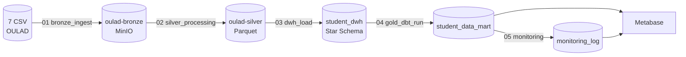

# OULAD Student Data Warehouse

End-to-end batch data platform for the Open University Learning Analytics Dataset (OULAD).

## Tech stack

- Apache Airflow: orchestration (event-driven via Datasets)
- MinIO: S3-compatible data lake
- PySpark: Bronze → Silver + Silver → DWH ETL
- MySQL 8.0: warehouse (DWH + marts)
- dbt: marts modeling and tests
- Metabase: BI dashboards (dashboards-as-code)
- Docker Compose: local runtime



## Architecture summary

1. Bronze ingest validates 7 OULAD CSV files in MinIO `oulad-bronze` bucket.
2. Silver processing transforms and validates CSV, writes Parquet to `s3://oulad-silver/`.
3. DWH load builds star schema in `student_dwh` (Dim_* + Fact_Performance, 173,912 rows).
4. dbt builds marts in `student_data_mart` and runs 72 tests.
5. Monitoring DAG runs 18 PySpark health checks and writes to `monitoring_log`.

Pipeline orchestration is event-driven with Airflow Datasets for cross-DAG dependencies.

## Project structure

- `dags/`: Airflow DAGs (5 stages)
- `scripts/`: PySpark ETL jobs + Metabase setup/export
- `dbt_student/`: dbt project (1 staging + 5 marts)
- `docker/`: custom Airflow/Spark images + MySQL init schema
- `metabase/dashboards/`: 5 dashboard JSONs (version-controlled)
- `docs/`: dashboard screenshot guides

## Quick start

1. Create `.env` from sample:

```bash
cp .env.example .env
```

2. Download OULAD dataset:

```bash
make setup-data
```

3. Bootstrap services, initialize schema, run pipeline, setup dashboards:

```bash
make all
```

4. Open services:

- Airflow: http://localhost:8080 (`admin` / `admin`)
- Metabase: http://localhost:3000 (`admin@oulad.local` / `oulad12345`)
- MinIO console: http://localhost:9001 (`minioadmin` / `minioadmin`)
- MySQL: `localhost:3307` (`root` / `rootpassword`)

## DAGs (current IDs)

- `bronze_ingest`: validate 7 CSV files exist in MinIO bronze bucket
- `silver_processing`: bronze CSV → silver Parquet (PySpark validate + clean)
- `dwh_load`: silver Parquet → MySQL star schema (PySpark JDBC)
- `gold_dbt_run`: dbt build + test marts
- `monitoring`: PySpark health checks → `monitoring_log`

## Recommended run flow

1. Unpause and trigger pipeline:

```bash
make trigger-pipeline
```

`bronze_ingest` triggers the downstream chain (silver → dwh → dbt → monitoring) via Airflow Datasets.

## Useful commands

```bash
make help
make up
make down
make logs
make airflow-logs
make dbt-run
make dbt-test
make monitoring
make metabase-setup
make metabase-export
make mysql-shell
```

## Dashboards (Metabase)

5 dashboards version-controlled in `metabase/dashboards/`. Auto re-import via `make metabase-setup` (idempotent).

- `00 Executive Summary`: KPIs → problem → diagnosis → quantified action items
- `01 Student Performance`: KPI + result distribution + at-risk leaderboard
- `02 Pipeline Health`: health checks + status trend + failure leaderboard
- `03 Demographics & Success Factors`: funnel + IMD/region/disability impact + recommendations
- `04 Module Performance Matrix`: module ranking + length vs pass rate + curriculum review

Dashboard screenshot guide: `docs/screenshots/README.md`.

## Historical / re-import

Snapshot dashboards after manual edits in Metabase UI:

```bash
make metabase-export
git commit metabase/dashboards/ -m "tweak dashboards"
```

Re-create after volume reset:

```bash
make metabase-setup
```

## Dataset

[Open University Learning Analytics Dataset (OULAD)](https://analyse.kmi.open.ac.uk/open_dataset) — 7 CSV, ~32K students, 4 presentations (2013J/B, 2014J/B), 7 modules, ~10M VLE click events.

## Notes

- Schema, indexes and partitions initialized from `docker/mysql/init.sql`.
- Composite indexes on `Fact_Performance(risk_group, final_result)` reduce mart scan ~86%.
- `monitoring_log` partitioned by quarter (RANGE on `checked_at`).
- For production, use versioned migrations and managed secrets.
